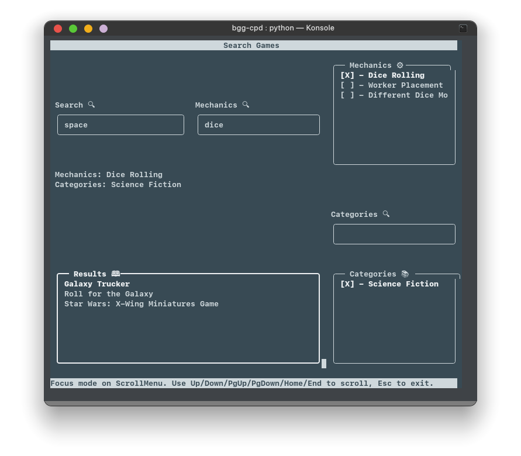

# Final Project For The Subject of "Clasification and Querying of Data"

## Dependencies

Before running this project, you'll need a python 3 environment, as well as the `py_cui` and `BeautifulSoup` libraries:

```
pip install py-cui beautifulsoup4 --user
```



## Running

After you've installed the dependencies, just fire up a terminal and run `python main.py`, and you should be good to go.


## Cache (Optional, Recommended)

Even though you could just run the code and fill the database, BoardGameGeek's API is very, very, very slow. It rate-limits us pretty hard. This is why I recommend downloading the latest [release](https://github.com/PietroCarrara/bgg-cpd/releases/latest) (about 300MB), which comes with a filled cache. This has nothing to do with the actual database implementation, it just affects the data fetching module: If it verifies that a cache file is available for a specific URL, it will just read the file instead of making an actual request (pretty handy during development).

## Configuration (Optional)

The [list of games](game_list.py) contains an array with the id's of several games. If you'd like to add a new game for fetching, add it here.

There is also the comment_limit variable (since BGG's API is so slow) at [bggapi.py](bggapi.py). It's current value is 500, which means that each game and expansion will have at most 500 comments. They actually have like 16k each, but I think we'd have to wait too long to fetch that.